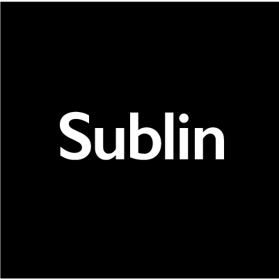
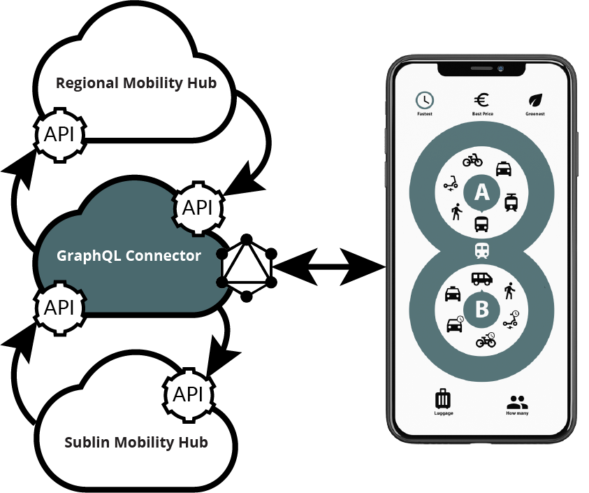

 

# Sublin App Prototype
Sublin is a MaaS (Mobility-as-a-Service) app for end users, transport operators (that do not run any other dispositon solutions) and sponsors. Sponsors provide transport services that are carried out by transport operators so that end users are not being charged for. Transport operators can specifiy their services (like areas they serve) and manage bookings. 

The goal of Sublin is to provide seamless intermodal routes between A and B without one's own car combining public transport with on demand transportation services. 

## Prototype
The Sublin app connects with a Firebase project. The app creates intermodal routes and combines scheduled puplic transportation with on demand transportation services. The prototype is connected with a Firebase backend. 

The prototpye accomodates three different user types. A [demo video](https://youtu.be/fUwMlH78LVI) featuring all three types can be is available here.

### End user
End users can book an intermodal route. Only addresses are available that are either accessible via public transportation or via an on demand transport operator if the address is sponsored by sponsors like bussinesses for their employees, hotels for their guests or city councils for their citizens etc.

### Transport operator (provider)
Transport operators can choose the areas they offer their services in and a train station where they provide shuttle services from. With the prototype only one train station can be picked. 

### Sponsor
Sponsors can either sponsor legs to a particular address or to all address within the bounds of an area - either for all or limited to a specified list of users. 

## Goal
The Firebase backend is only intended to be the
evolves into a provider [agnostic digital mobility](https://github.com/schadauer/Sublin-Digital-Mobility-Hub).
The app will connect to the Sublin mobility hub with a GraphQL client whereas an abstraction interface will be developed that allows other types of services as well. 

Sublin adhere to the [TOMP API](https://app.swaggerhub.com/apis/TOMP-API-WG/transport-operator_maas_provider_api/) specification. GraphQL calls resolve to the API endpoints described in this specification. Calls from the hub to the GraphQL connector will be subscribed to using GraphQL subscription.

## Milestones

### Create tests
Tests need to be created to allow CI/CD. 

### Create CI/CD workflow

### Adapt classes and properties to be TOMP-API compliant
The prototype is not fully aligned with the TOMP specification. 

### Add abstraction layer for services

### Implement GraphQL connector client

### Allow multiple stations per transport operators

## License
MIT
